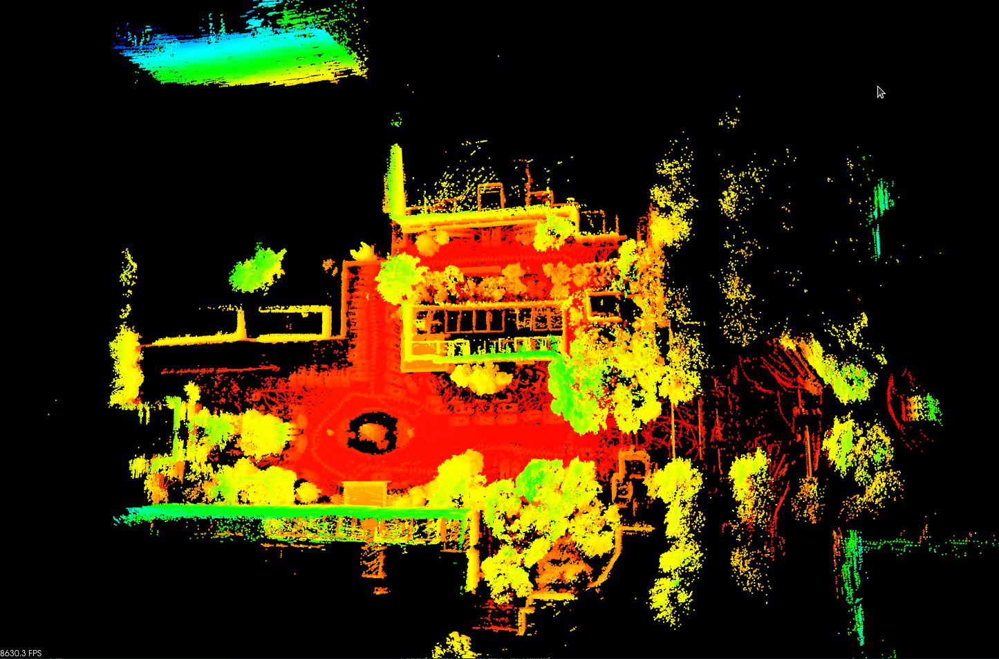
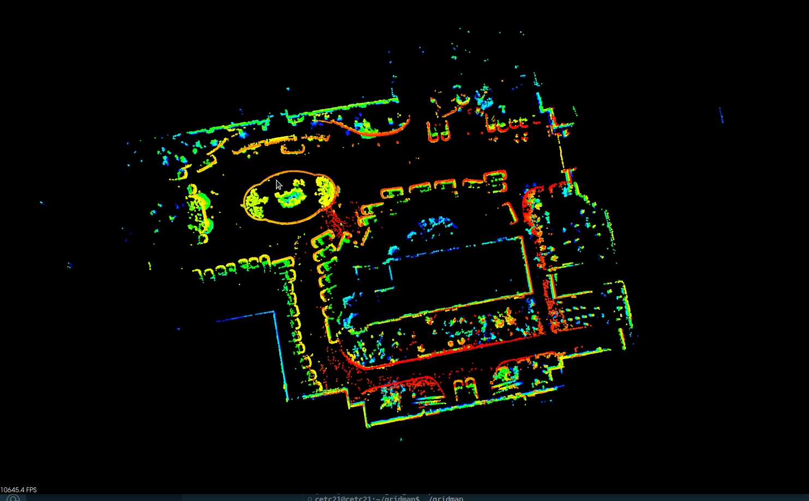
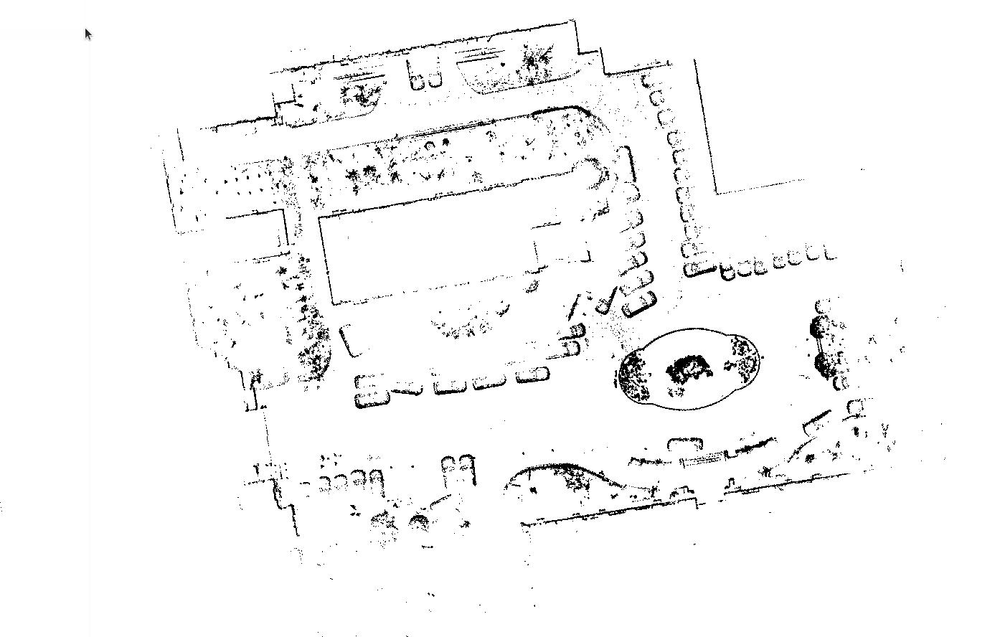
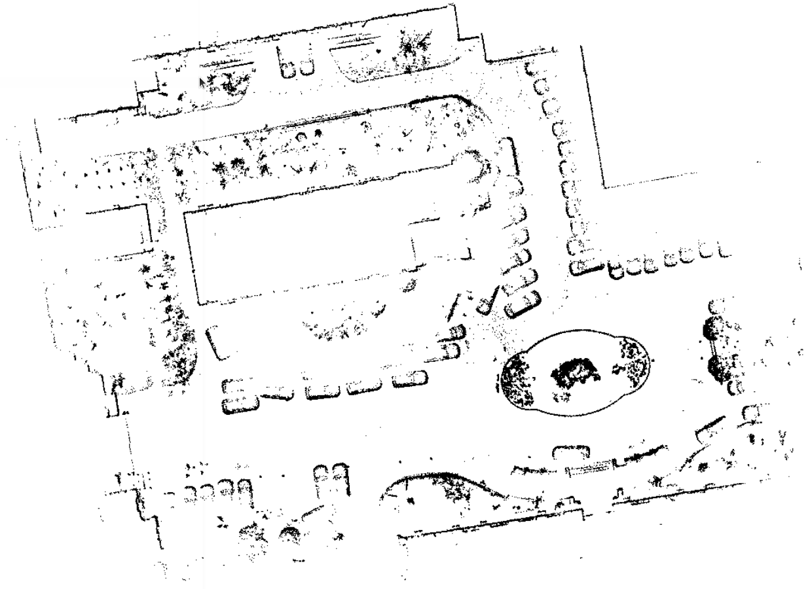

Documentation:
        用于对PCD格式的点云地图转化为栅格地图，给机器人导航定位使用，其流程主要包括地面点去除、统计滤波降噪、自适应转化为合适尺寸./pgm格式的栅格地图，并对栅格地图进行噪声滤除

    注：本代码可集成为gridmap模块，按照CMakeLists.txt和build.sh文件中注释自行修改；如果使用动态库开发，只需要链接libgridmap.so和包含头文件gridmap.h即可
Prerequisities：
        -Ubuntu 20.04
        -PCL  1.10.0
        -C++ 11 or 14
   	-GCC  9.4.0
        -CMake 3.16.3
Building:
        ./build.sh
Running:
        ./gridmap_lib

Test Procedure:

    1、Primary point cloud

   2、Target is not a ground point

3、Original grid map

4、Target grid map

